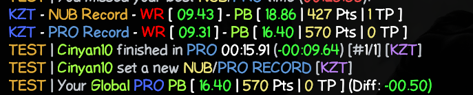

# gokz-gpb-display

A SourceMod plugin for GOKZ servers that displays a player's GlobalPB and WR upon spawning or completing a run with points

## Commands

- `!pb` or `!gpb` — Manually show your GlobalPB and WR
